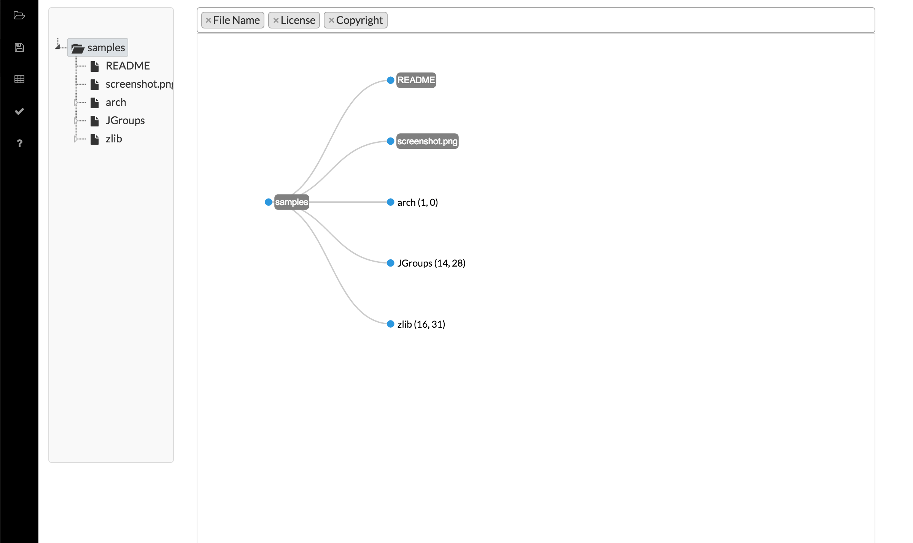

# 

AboutCode Manager provides an advanced visual UI to help you quickly evaluate
license and other notices identified by [ScanCode] (https://github.com/nexB/scancode-toolkit/) and record your conclusion
about the effective license(s) for a component. AboutCode Manager is based on
Electron and will be the primary desktop/GUI tool for using nexB’s AboutCode
tools. This app works on Windows, OS X and Linux operating systems.

The ScanCode toolkit detects licenses, copyrights and other interesting
information in your code. The AboutCode Manager allows you take the scan results
from the ScanCode Toolkit and create components. By creating these components
within in your codebase, you are creating a software inventory of your product.
The conclusions (Concluded License, Concluded Owner, etc.) you make when
creating your component can then be exported to a JSON file.



## Using

* You can [download the latest release](https://github.com/nexB/aboutcode-manager/releases) for your operating system or build it yourself (see below).
Once downloaded, you can find `AboutCode-Manager` under `dist/AboutCode-Manager-<os>-x64-<version>`.
* AboutCode Manager is only compatible with scans from [ScanCode Toolkit v2.0.0-RC1] (https://github.com/nexB/scancode-toolkit/releases) and above.
* Scans imported into the app need to contain the file information data. Therefore, the `-i` option needs to be used in your ScanCode command. For example:

```bash
./scancode -clip
```

See the [wiki] (https://github.com/nexB/aboutcode-manager/wiki) for more documentation on how to use the app.

## Building

You'll need [Node.js](https://nodejs.org) (which comes with [npm](http://npmjs.com)) installed on your computer in order to build this app.
Then, from your command line:

```bash
# Clone this repository
git clone https://github.com/nexB/aboutcode-manager.git
# Go into the repository
cd aboutcode-manager
# Install dependencies and run the app
npm install && npm start
```

## Release instructions

Build `dist` target:

```bash
$ ./build.sh
```

After building is done, you can find `AboutCode-Manager` under `dist/AboutCode-Manager-<os>-x64-<version>`.
Archives (tar.gz and .zip) are also built.

## Testing

Test functionality using:

```bash
$ npm test
```

## License

* Apache-2.0 with an acknowledgement required to accompany the scan output.
* Public domain CC-0 for reference datasets.
* Multiple licenses (LGPL, MIT, BSD, etc.) for third-party components.

See the NOTICE file for more details.

## Support

If you have a question, a suggestion or find a bug, enter an issue.

For questions and chats, there is an official #aboutcode IRC channel on freenode for
scancode and other related tools. You can use your favorite IRC client or use the
web chat at http://webchat.freenode.net/
