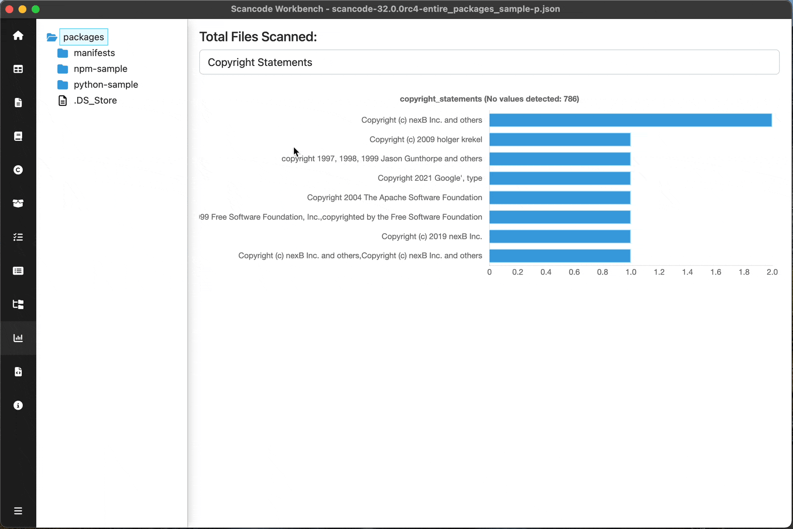
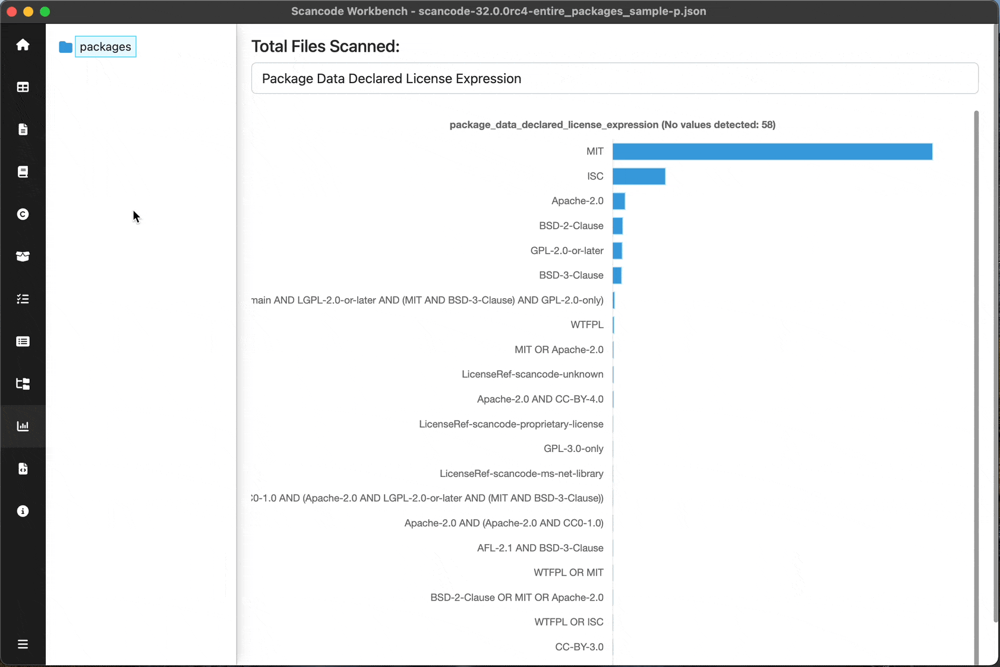

================================================
:index:`How-To: Navigate the Chart Summary View`
================================================

Display the Chart Summary view
================

Once you have a SQLite file loaded into ScanCode Workbench, displaying the Chart
Summary View is easy:

* Select a file or directory in the Tree View on the left.
* Click on `Chart Summary View` in the sidebar or open the :kbd:`View` menu and select :kbd:`Chart Summary View` (keyboard shortcut: :kbd:`Ctrl+Shift+D` or :kbd:`⌘+Shift+D`).

Select an attribute
===================

Use the dropdown at the top of the view to select the attribute you want to
examine (e.g., ``Copyright Statements``, ``Detected License expression``).  These attribute values
are detected from ScanCode, and can also be viewed in the Table View.

When you select an attribute, the Chart Summary View will automatically refresh
to display a horizontal bar chart showing -- in descending order of frequency --
each value identified in the scanned codebase for the selected attribute and the
number of times it occurs in the codebase.  You can also see the value for a
particular entry in the bar chart in a tooltip that appears when you move your
cursor over the text on the left or the bar on the right.

Filter Chart Summary
====================

You can further filter the summary results by choosing a specific directory or
file in the Tree View. The chart will then only show results for that selected
directory or file.

For entire UI reference, Read :ref:`chart-summary-view` 