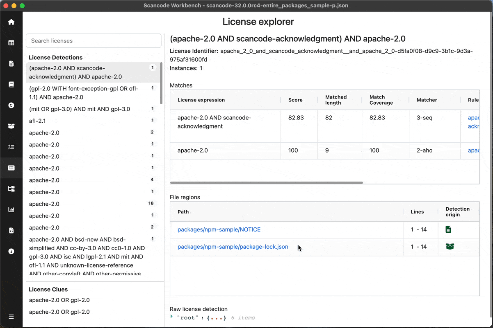
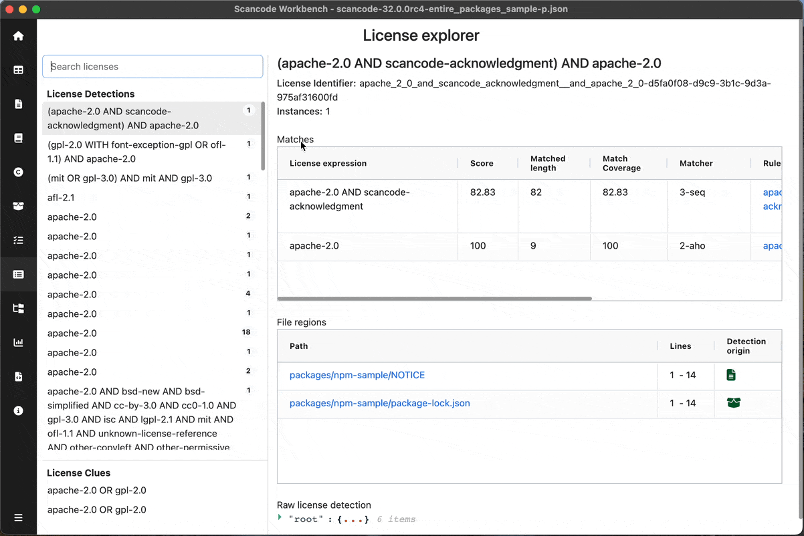
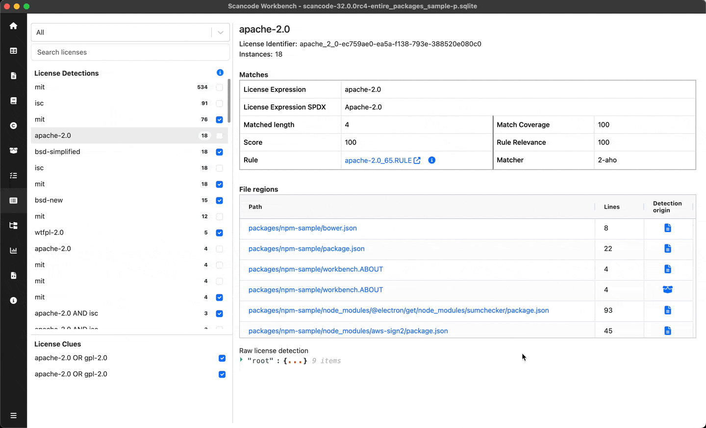

====================================================
:index:`How-To: Navigate the License Explorer View`
====================================================

Display the License Explorer view
===================================

Once you have a SQLite file loaded into ScanCode Workbench,

Click on `License Explorer` in the sidebar or open the :kbd:`View` menu
and select :kbd:`License Explorer`

Select and search for a License
==================================

On the left pane, Licenses are shown in two categories: `License Detections` & `License clues`.
You can select any of these licenses & more detailed information about
that license will be reflected on the right

Review licenses
===========================================

When reviewing large number of licenses over multiple sessions,
You can tick the checkbox beside any of theselicense detections or clues to
mark them as reviewed or unreviewed so that you can continue from where you left off.

Based on this review status, you can filter the licenses using filter options on the top

.. figure:: data/license-explorer-review.gif

Matches & File regions table
===================================

For the selected license, you can view the details of matches resulting into the
detection and the file regions where the license was detected.

In the file regions table, You can click on the data file path to view that path in Tableview.
Similarly, detection origin is a clickable icon. It determines the source of detection.

- Package icon indicates that the detection belongs to a package manifest,
  you can click on it to view the source package manifest in :ref:`package-explorer`.

- File icon indicates that the detection belongs to a plain file, you can click on it to view the file in :ref:`table-view`.

For entire UI reference, Read :ref:`license-explorer`

.. include:: ../../rst_snippets/scans-used.rst
