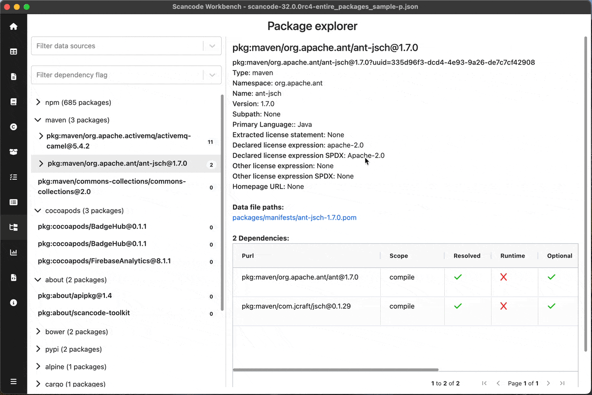
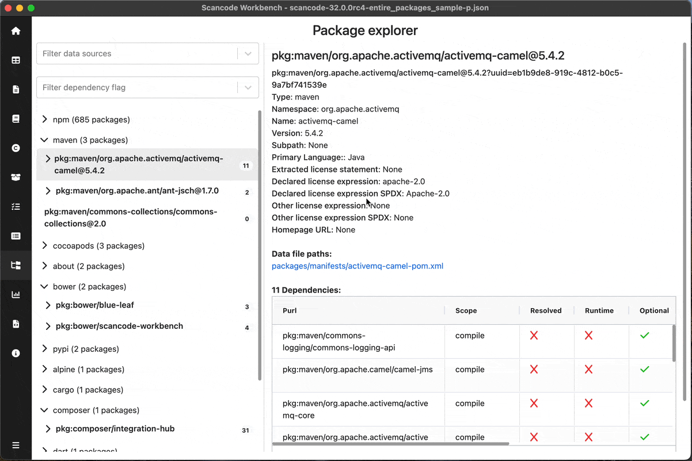
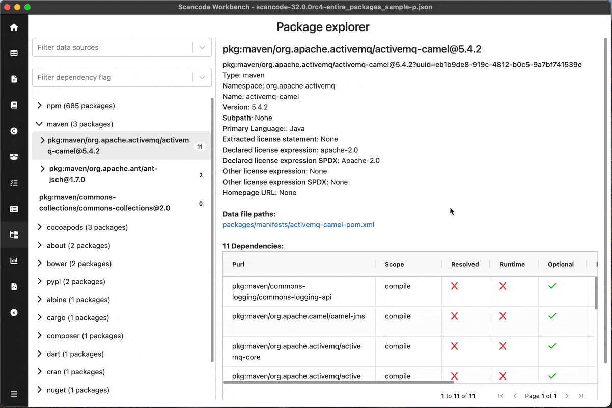

================================================
:index:`How-To: Navigate the Package Explorer View`
================================================

Display the Package Explorer view
================

Once you have a SQLite file loaded into ScanCode Workbench,

* Click on `Package Explorer` in the sidebar or open the :kbd:`View` menu and select :kbd:`Package Explorer`

Select a Package or Dependency
=========================

On the left pane, Packages are shown in a hierarchical manner as `Package Type` > `Package` > `Dependencies`
Upon selecting a Package / Dependency, details of the entire entity is shown on the right.

For a Package, information like `PURL, namespace, Declared license expression, Dependencies table, etc` are shown.

For a Dependency, information like `Scope, Data file, Data source ID, etc` are shown.

Filters
====================

You can filter the packages / dependencies by their data sources and/or dependency flags by selecting filter values in the top-left

Dependencies table
====================

When a package is selected, the dependencies for that package are shown in a table in the details pane showing Dependency information like `PURL, Scope, Data source ID, etc`

You can sort the table as per convenience.

You can click on the :kbd:`Data file path` to see that file in the TableView

For entire UI reference, Read :ref:`package-explorer` 
