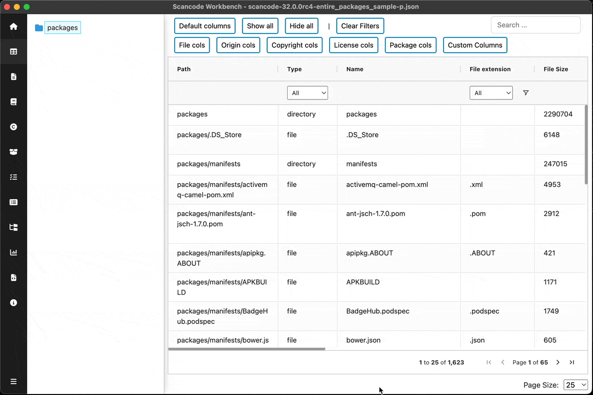

================================================
:index:`How-To: Navigate the Table View`
================================================

Display the Table view
============================

Once you have a SQLite file loaded into ScanCode Workbench, you're automatically redirected to the Tableview.
To navigate to Tableview from other views you can click on `Table View` in the sidebar or open the :kbd:`View` menu and select :kbd:`Table View`

* Click on `Package Explorer` in the sidebar or open the :kbd:`View` menu and select :kbd:`Table View`

Select a path
========================

You can collapse/expand the FileTree on the left and select a file/directory. Only the files under this path will be visible in the tableview

Select Preset columns
==========================

You can select one of the available column groups, grouped based on their nature such as ``Copyright Cols``, ``Origin Cols``, ``License Cols``

.. figure:: data/tableview-column-groups.gif

For entire UI reference, Read :ref:`table-view` 
