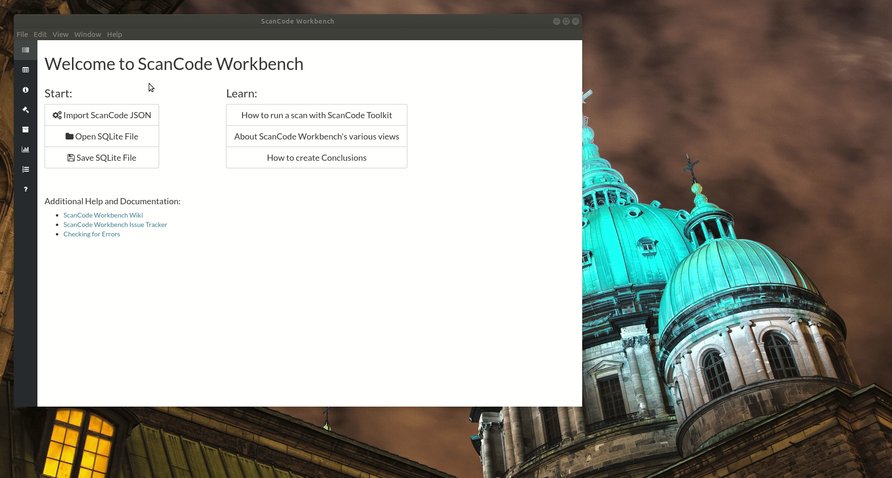

=====================================
How-To: Import and Export a JSON File
=====================================

Import a ScanCode JSON File
===========================

* We have provided a set of sample scans that you can quickly review in ScanCode Workbench in order
  to get a sense of its functionality and the types of information captured by a scan.  The samples
  are located at `https://github.com/nexB/scancode-workbench/tree/develop/samples <https://github.com/nexB/scancode-workbench/tree/develop/samples>`_.

* To import a ScanCode JSON file:

  * Open the :kbd:`File` menu and select :kbd:`Import JSON File` (keyboard shortcut:
    :kbd:`Ctrl+I` or :kbd:`⌘+I`).
  * In the dialog window that opens, navigate to the JSON file you want to import, select the
    file and click :kbd:`Open`.
  * You will then be prompted to choose a filename and location to save the JSON file as a SQLite
    database file.  Add a filename, select the folder in which you want to save the SQLite database
    file, and click :kbd:`Save`.
  * ScanCode Workbench will then create a SQLite database file from your JSON file, indicated by
    the status message ``Creating Database ...``
  * Once the process has finished, the status message will be replaced by an expandable code tree
    and, to the right of the tree, a table displaying provenance information generated by ScanCode.

Export a JSON file
==================

* To export a JSON file:

  * Select the :kbd:`File` menu and then select :kbd:`Export JSON File` (keyboard shortcut:
    :kbd:`Ctrl+E` or :kbd:`⌘+E`).
  * In the dialog window that opens, add a name for the file, navigate to the directory in which
    you want to save the file and click :kbd:`Save`.
