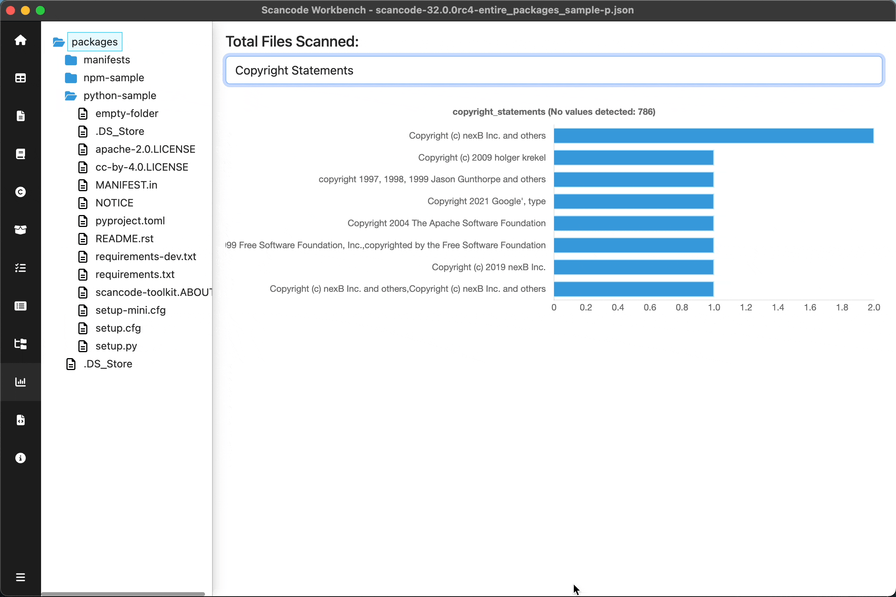

.. _chart-summary-view:

===========================
:index:`Chart Summary View`
===========================

With the chart summary view, a user can select a node in the directory tree (i.e., a directory,
folder or file) and display a horizontal bar chart listing the values identified in the scanned
codebase, i.e. the ScanCode Toolkit detections, for a number of different
attributes.

The attributes are a subset of the columns displayed in the table view, and can be
selected by clicking the dropdown at the top of the view. The chart displays the full range of
values for the selected directory tree node and attribute and the number of times each value occurs
in the scanned codebase.

.. include:: ../rst_snippets/scans-used.rst
