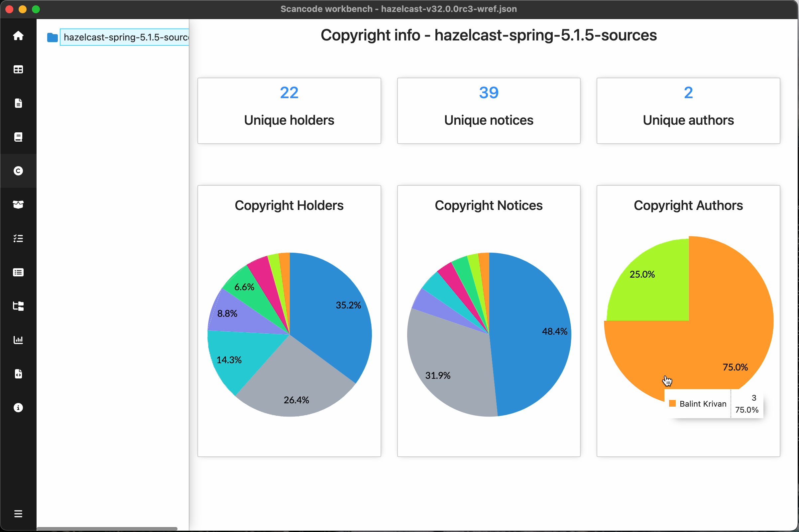

.. _copyright-info-dashboard:

===================================
:index:`Copyright Info Dashboard`
===================================

Copyright info dashboard summarizes the copyright information detected
in scan for files under the selected path.
Scan must have ``--copyright`` option for Copyright Info Dashboard.

Summary of Copyrights:

- Unique holders
    No. of unique copyright holders detected.
- Unique notices
    No. of unique copyright notices detected.
- Unique authors
    No. of unique copyright authors detected.

- Pie charts
    - Copyright Holders
        Distribution of unique copyright holders indicating the number of files
        in which each copyright holder was detected.
    - Copyright Notices
        Distribution of unique copyright notices indicating the number of files
        in which each copyright notice was detected.
    - Copyright Authors
        Distribution of unique copyright authors indicating the number of files
        in which copyrights were authored by each author.

.. include::  /rst_snippets/refer-pie-charts.rst

.. include::  /rst_snippets/copyright-pie-charts-notice.rst

.. include:: ../rst_snippets/scans-used.rst
