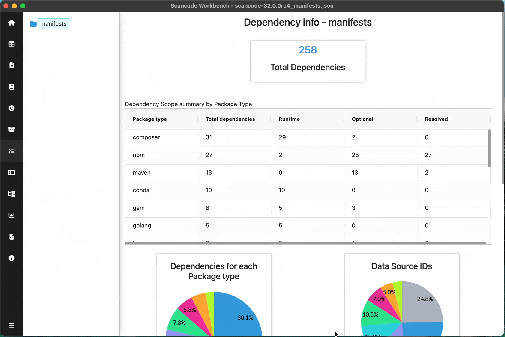

============================
:index:`Dependency Info Dashboard`
============================

Scan must have ``--package`` option for Dependency Info Dashboard

Summary of Dependencys:

- Count of
    - Dependencies

- Summary table
    - Dependencies per Scope (Runtime, Optional, Resolved) for each Package Type

- Pie charts
    - Dependencies for each Package type
    - Data source IDs
    - Runtime dependencies
    - Resolved dependencies
    - Optional dependencies

Tip - Slices of pie-chart can be hidden/shown by clicking on the corresponding legend below charts

