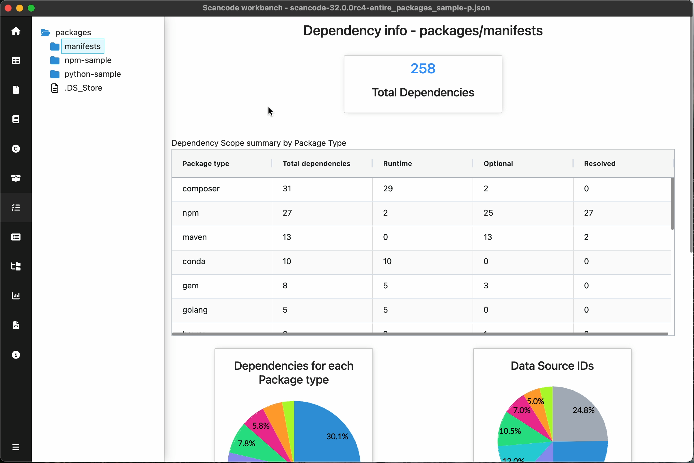
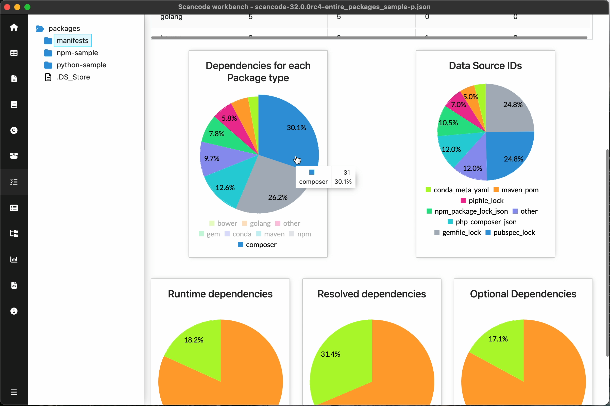
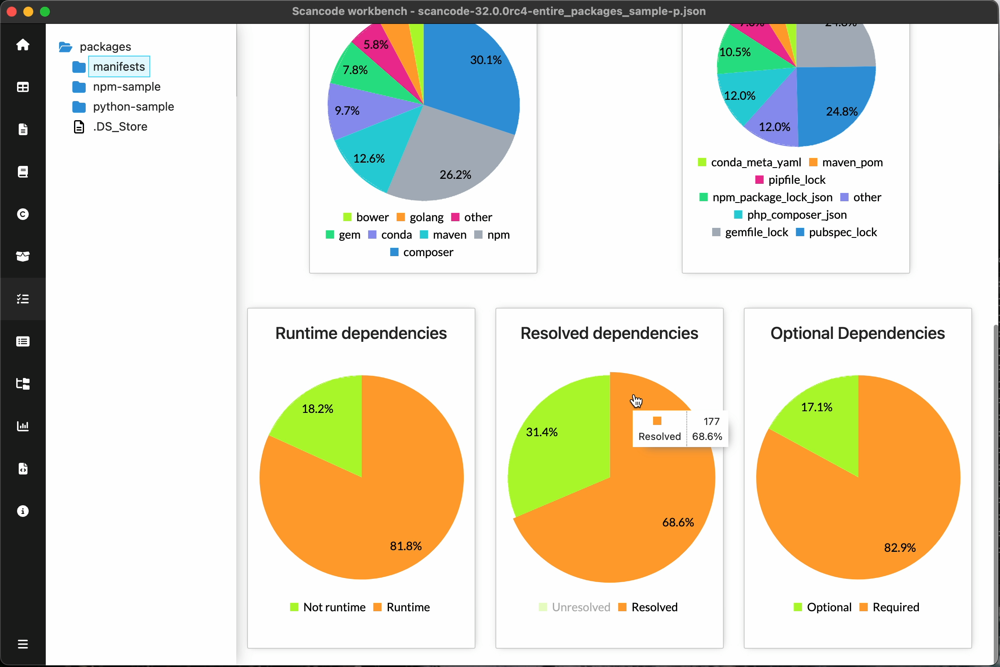

.. _dependency-info-dashboard:

=====================================
:index:`Dependency Info Dashboard`
=====================================

Dependency info dashboard summarizes the dependencies information detected
in scan for files under the selected path.
Scan must have ``--package`` option for Dependency Info Dashboard

Summary of Dependencys:

- Total number of Dependencies detected

- Summary table
    - Dependencies per Scope (Runtime, Optional, Pinned) for each Package Type

- Pie charts
    - Dependencies for each Package type
    - Data source IDs
        Distribution of Unique data source IDs. eg. ``maven_pom``, ``pipfile_lock``, etc
    - Runtime dependencies
    - Resolved dependencies
    - Optional dependencies

.. include::  /rst_snippets/refer-pie-charts.rst

************************************************************
Package type wise Scope  summary
************************************************************

************************************************************
Charts
************************************************************

.. include:: ../rst_snippets/scans-used.rst
