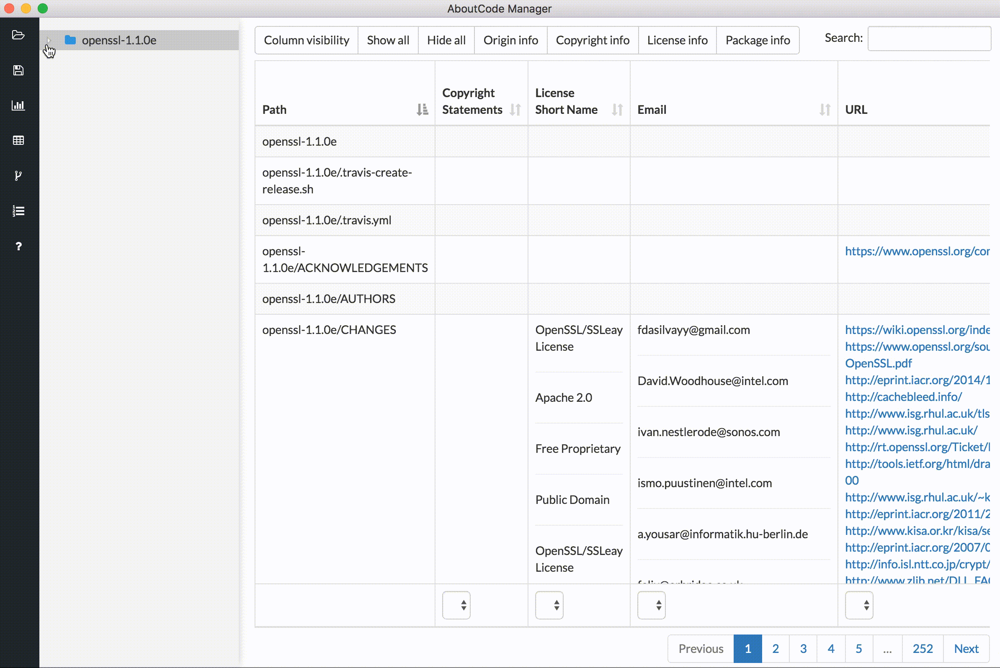

==============
Directory Tree
==============

:guilabel:`[Intro to come.]`

An interactive directory tree is always present on the left side of the application. The tree is
expandable and collapsible. This allows the user to navigate the codebase structure. If a directory
is selected, only that directory and its sub-files and folders will be shown in the view.
Similarly, if a single file is selected, only information for that selected file will be shown.

