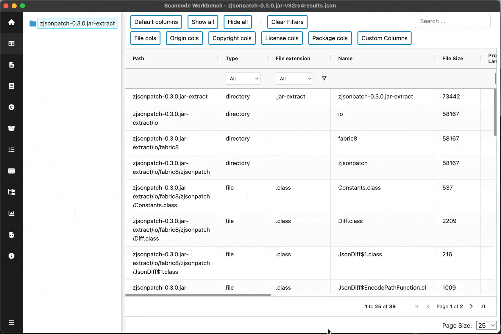
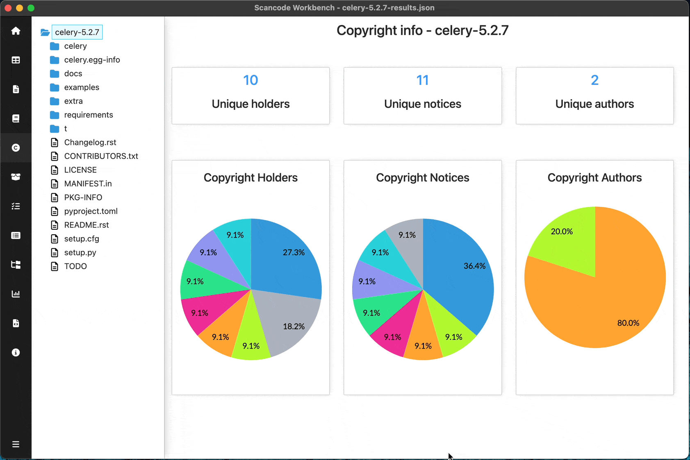
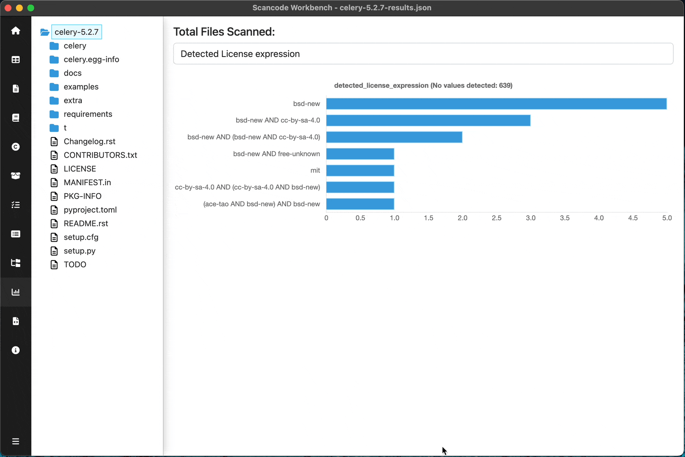

=======================
:index:`Directory Tree`
=======================

An interactive directory tree is present on the left side of the application for resource-focused
views. This allows the user to navigate the codebase structure.

If a directory is selected, only the information for that directory and its sub-files and folders
will be shown in the view.
Similarly, if a single file is selected, only information for that selected file will be shown.

Demo of filetree on different views:
------------------------------------------------

.. include:: ../rst_snippets/scans-used.rst
