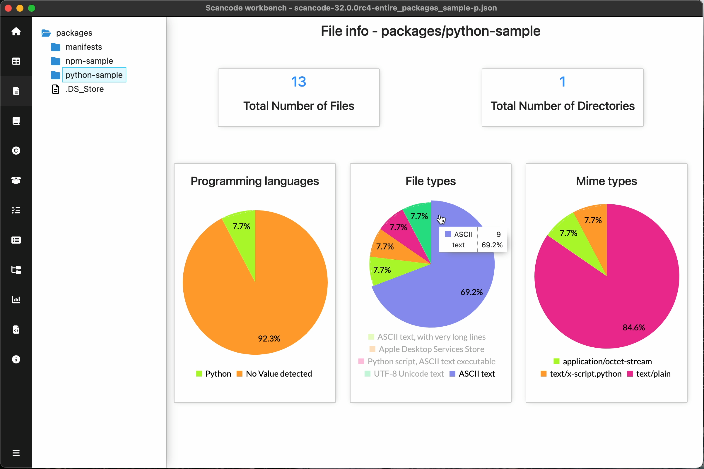

.. _file-info-dashboard:

============================
:index:`File Info Dashboard`
============================

File Info Dashboard summarizes the file information in scan for the selected path.
It is a good starting point to understand the file types and
programming languages used in the project.
Scan must have ``--info`` option enabled for the data required in File Info Dashboard.

Summary of files:

- Total number of Files (under the selected path)
- Total number of Directories (under the selected path)
- Pie charts
    - Programming languages
    - File Types
    - Mime Types

.. include::  /rst_snippets/refer-pie-charts.rst

.. include:: ../rst_snippets/scans-used.rst
