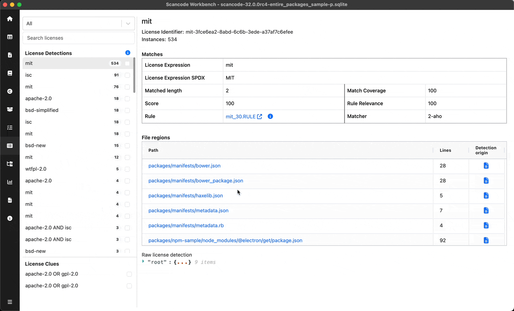
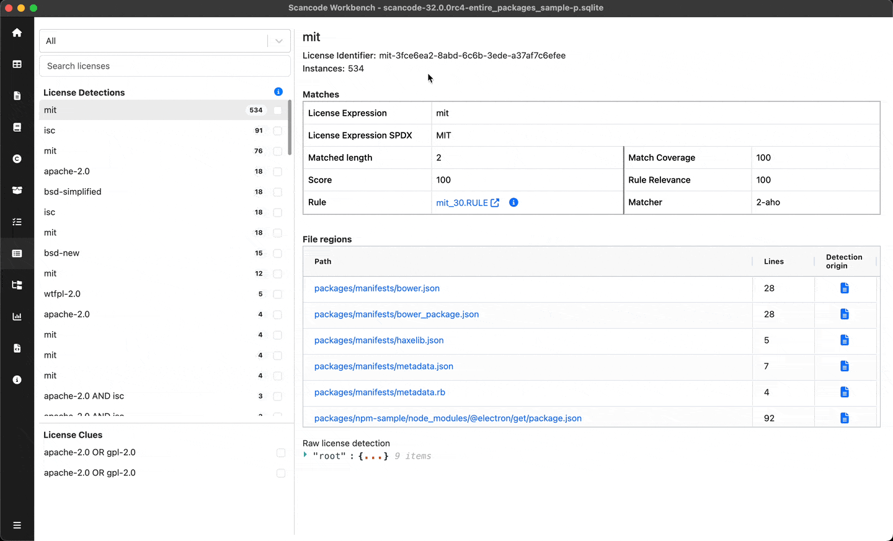
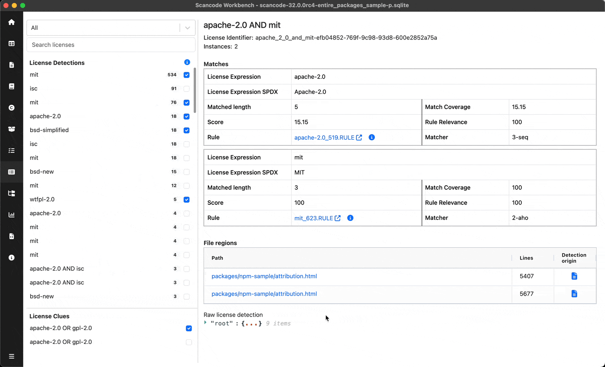
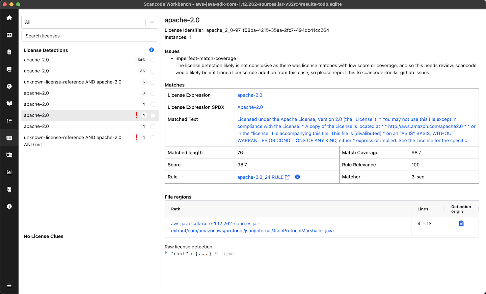
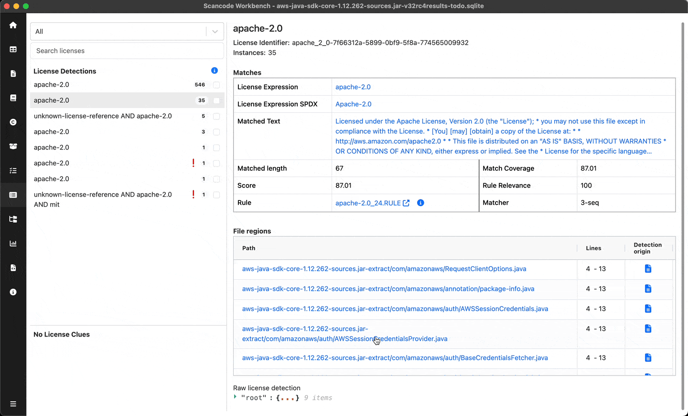

.. _license-explorer:

============================
:index:`License Explorer`
============================

Details of all the License detections and clues including Matches as well as files in which they
were detected can be viewed using the License Explorer.

Refer -
:doc:`scancode-toolkit:reference/license-detection-reference`

License Navigation Pane
-------------------------------
User can scroll through the licenses and select particular license to see
detailed information in the License details pane. Licenses are divided into two sections:

- License Detections
- License Clues

These sections' height & navigation pane's width can be adjusted as per convenience.

Search Licenses
====================

You can search for any license detecttion / clue by typing in the search box on the top-left

Filter & Mark Licenses as Reviewed / Unreviewed
===================================================

When reviewing large number of licenses over multiple sessions,
You can tick the checkbox beside any of theselicense detections or clues to
mark them as reviewed or unreviewed so that you can continue from where you left off.

Based on this review status, you can filter the licenses using filter options on the top

License Details Pane
------------------------------------------
For the selected license, you can view the details of matches resulting into the
detection and the file regions where the license was detected.

- Title of details pane - License Expression
- Instances - No. of times license is detected
- Score - Clue's confidence about the license (Shown only for clues)

To-Do
====================

Issues (if any) associated with license detections are listed with relevant details.
License detections with issues are marked with a warning icon in the navigation pane.

Matches Table
====================

User can view the match details resulting the selected license :

- ``License expression`` & ``SPDX License expression``
- ``Matched length``
- ``Match Coverage``
- ``Score``
- ``Rule relevance``
- ``Matcher``
- ``Matched Text``
    | User can click on the text to view a diff of Matched & Rule text
- ``Rule`` - User can click on the Rule to open the rule used byScanCode Toolkit in browser

To view more information about match rule, you can click on info button beside Rule name.
You can click on the Matched text to see the complete text as well as its difference with Rule text.

.. Note::
   Matched text is available in the scan only when ``--license-references`` flag is enabled in scan.

File Regions Table
====================

File regions table shows the files in which selected license was detected with following details

- ``Path`` - Path of file, User can click on it to view the specific file in TableView
- ``Lines`` - Specific lines in the file at which license was detected
- ``Detection origin`` - Type of origin (File or Package manifest)

You can click on the data file path to view that path in Tableview.
Similarly, detection origin is a clickable icon. It determines the source of detection.

- Package icon indicates that the detection belongs to a package manifest,
  you can click on it to view the source package manifest in :ref:`package-explorer`.

- File icon indicates that the detection belongs to a plain file,
  you can click on it to view the file in :ref:`table-view`.

.. figure:: data/license-explorer/license-explorer-fileregion.gif

.. include:: ../rst_snippets/scans-used.rst
