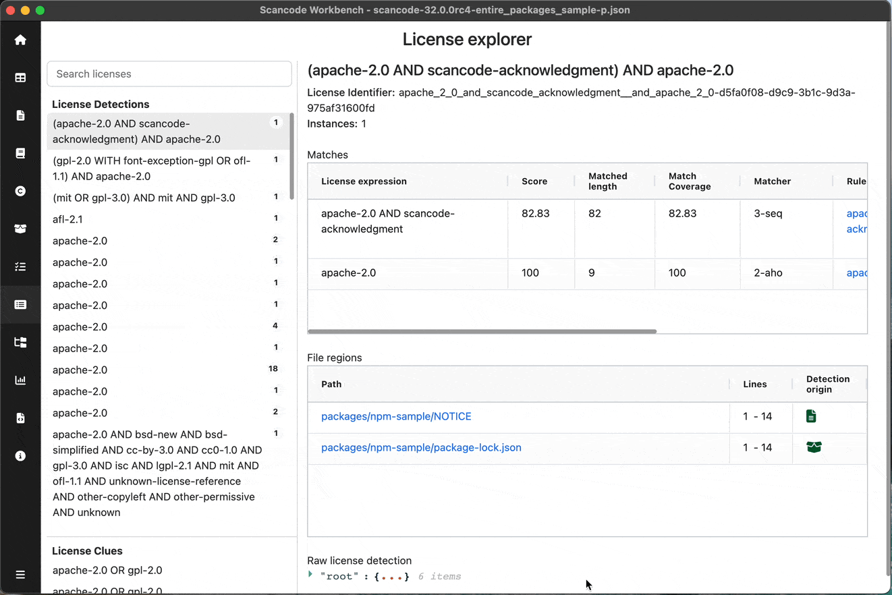
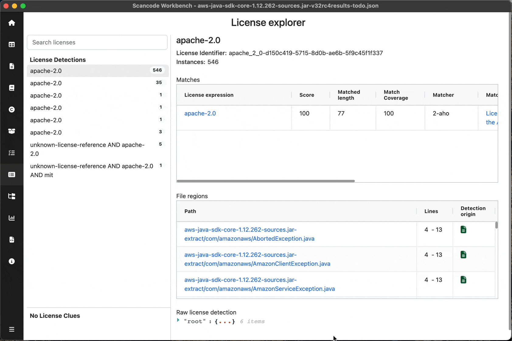

.. _license-explorer:

============================
:index:`License Explorer`
============================

Details of all the License detections and clues including Matches as well as files in which they
were detected can be viewed using the License Explorer.

Refer -
:doc:`scancode-toolkit:reference/license-detection-reference`

.. @TODO - Replace with anchored link after merging docs PR inScanCode Toolkit
.. :doc:`scancode-toolkit:reference/license-detection-reference#what-is-a-licensedetection`

License Navigation Pane
-------------------------------
User can scroll through the licenses and select particular license to see
detailed information in the License details pane. Licenses are divided into two sections:
- License Detections
- License Clues

User can search for a particular license using the search bar at the top.
These sections' height & navigation pane's width can be adjusted as per convenience.

License Details Pane
------------------------------------------
User can see detailed information of the license selected in the navigation pane.
Title of details pane - License Expression
Instances - No. of times license is detected
Score - Clue's confidence about the license (Shown only for clues)

Matches Table:

User can view the match details resulting the selected license :

- ``Score``
- ``Matched length``
- ``Match Coverage``
- ``Matcher``
- ``Matched Text``
    | User can click on the text to view a diff of Matched & Rule text
    | (Requires ``--license-references`` flag)
- ``Rule`` - User can click on the Rule to open the rule used byScanCode Toolkit in browser
- ``SPDX License expression``

File Regions Table:

User can view the files in which selected license was detected:

- ``Path`` - Path of file, User can click on it to view the specific file in TableView
- ``Lines`` - Specific lines in the file at which license was detected
- ``Detection origin`` - Type of file

View License details, go to & from file <-> license explorer
--------------------------------------------------------------------------------

View Matched Text diff
--------------------------------------------

.. include:: ../rst_snippets/scans-used.rst
