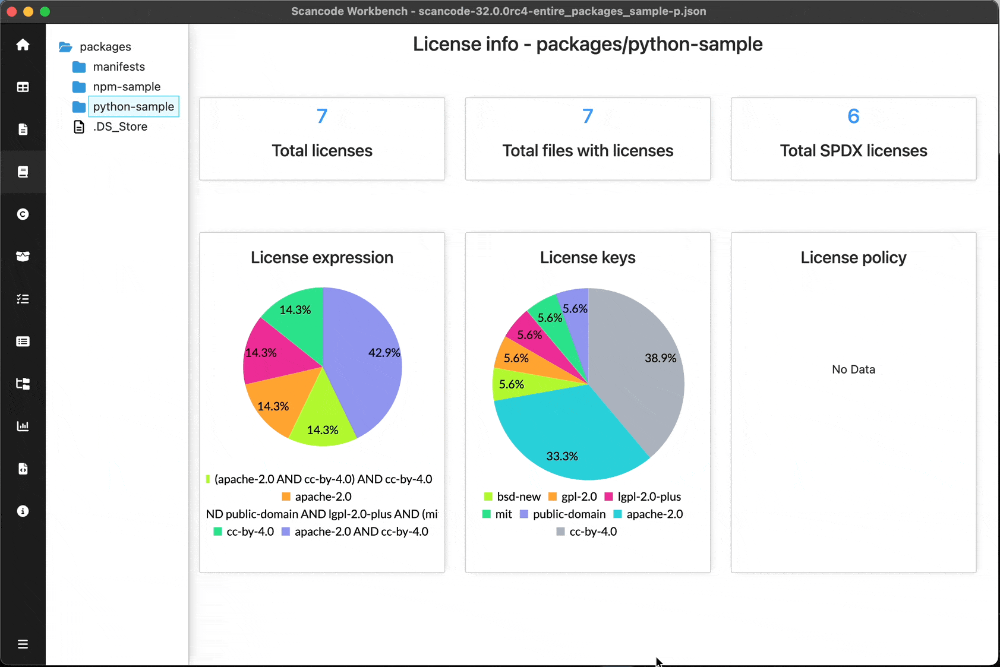

============================
:index:`License Info Dashboard`
============================

Scan must have ``--license`` option for License Info Dashboard

Summary of Licenses:

- Count of
    - Licenses (No. of unique licenses)
    - Files (No. of files having at least one license)
    - SPDX Licenses (No. of unique SPDX licenses)

- Pie charts
    - License expressions
    - License keys
    - License policies

Tip - Slices of pie-chart can be hidden/shown by clicking on the corresponding legend below charts

.. image:: data/license-info/license-info-with-policies.png