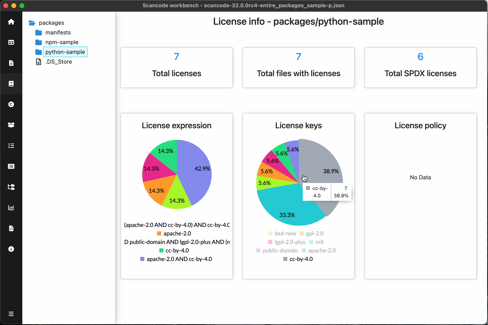
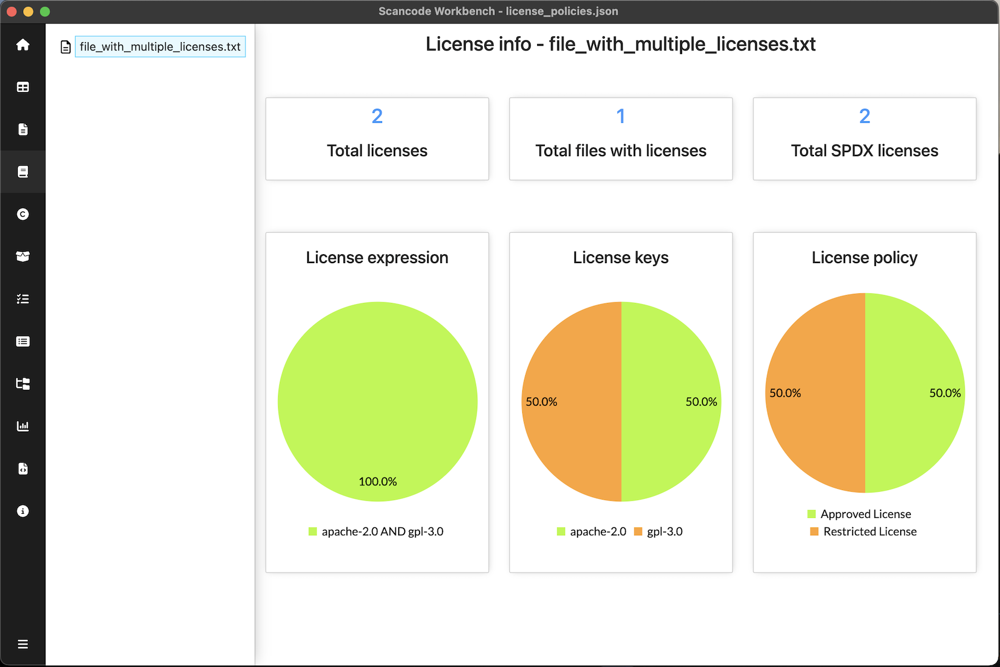

.. _license-info-dashboard:

================================
:index:`License Info Dashboard`
================================

License info dashboard summarizes the license information detected for files in the scan under the selected path. It is a good starting point to understand the declaration of licenses in the project.
Scan must have ``--license`` option enabled for the data required in License Info Dashboard.

Summary of Licenses:

- Licenses
    No. of unique licenses detected.
- Files
    No. of files (under the selected path) having at least one license detected.
- SPDX Licenses
    No. of unique SPDX detected.

- Pie charts
    - License expressions
        Distribution of unique license expressions indicating the number of files in which each license expression is detected.
    - License keys
        Distribution of unique license keys indicating the number of files in which each license key is detected.
    - License policies
        Distribution of unique license policies indicating the number of files in which each license policy is detected.

.. include::  /rst_snippets/refer-pie-charts.rst

.. include:: ../rst_snippets/scans-used.rst
