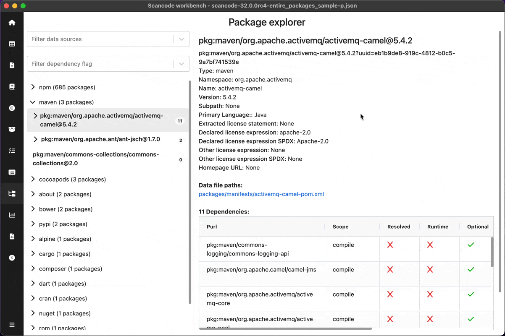
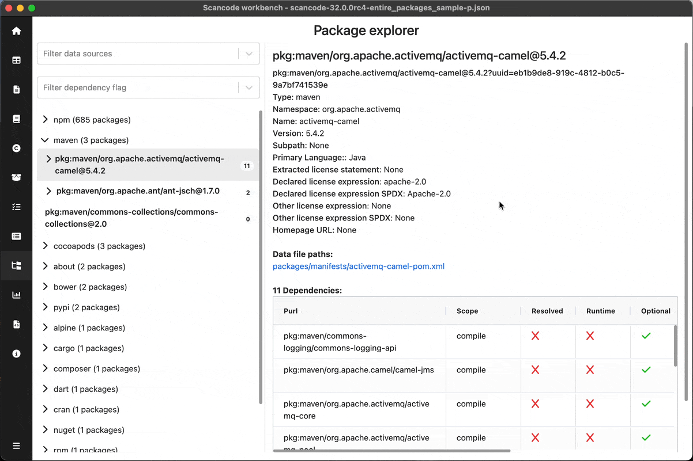
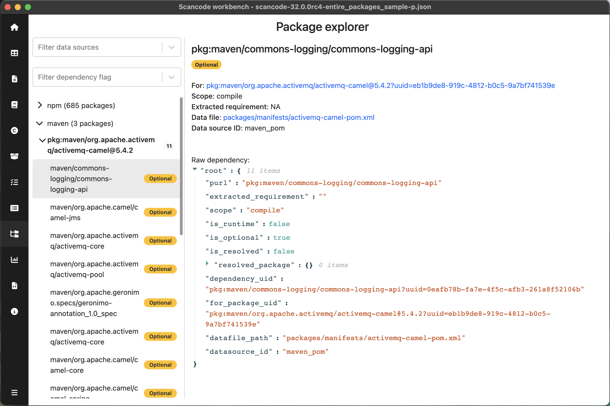

.. _package-explorer:

============================
:index:`Package Explorer`
============================

.. include:: ../definitions.rst

Details of all the Packages & dependencies as well as files in which
they were detected can be viewed using the Package Explorer.

Refer - :doc:`scancode-toolkit:reference/available_package_parsers`.

Package Navigation Pane
--------------------------------
User can scroll through the packages & dependencies and select particular package
to see detailed information in the Details pane.
Packages and dependencies are organised in a hierarchical structure as shown below.

> ``Package Type``
  > ``Package (PURL)``
    > ``Dependencies``

User can select different filters:

- Data sources - ``maven_pom``, ``go_mod``, ``npm_package_lock_json``, etc
- Dependency flags - ``Runtime``, ``Resolved``, ``Optional``

  Tip - You can click on the tag on the right side of the dependency to toggle that flag.

The navigation pane's width can also be adjusted as per convenience.

Package Details
--------------------

User can see following information of the selected package:

- ``Title of details pane``- PURL

  |purl_description|
- ``Type``
- ``Namespace``
- ``Name``
- ``Version``
- ``Subpath``
- ``Primary Language``
- ``Extracted license statement``
- ``Declared license expression``
- ``Declared license expression SPDX``
- ``Other license expression``
- ``Other license expression SPDX``
- ``Homepage URL``

***************************
Datafile paths
***************************
List of paths of datafiles in which the selected package/dependency was detected.
User can click on the datafile paths to open that path in the Tableview the match details
resulting the selected license.

***************************
Dependencies table
***************************

User can see all the dependencies of the selected package in the table, with following details:

- ``Purl``

  |purl_description|
- ``Scope``
- ``Resolved``
- ``Runtime``
- ``Optional``
- ``Data source ID``
- ``Data file``
- ``Extracted requirement``

Dependency Details
--------------------

User can see following information of the selected dependency:

- ``For`` - PURL of the package for which this dependency was detected
- ``Scope``
- ``Extracted requirement``
- ``Data file`` - Clickable datafile path to open the datafile in the Tableview
- ``Data source ID``

The Data file property is a clickable link that opens the Tableview with that file selected.

.. include:: ../rst_snippets/scans-used.rst
