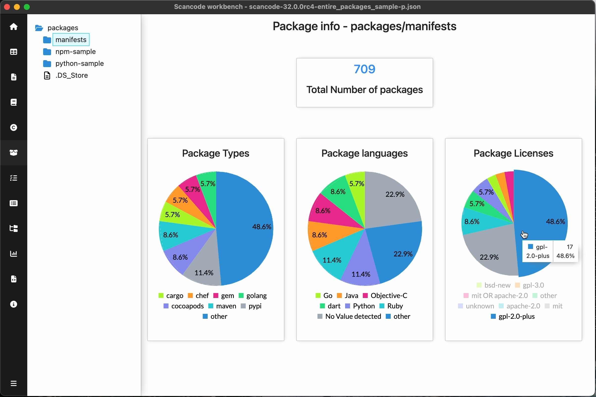

.. _package-info-dashboard:

===================================
:index:`Package Info Dashboard`
===================================

Package info dashboard summarizes the packages detected for files
in the scan under the selected path.
Scan must have ``--package`` option for License Info Dashboard

Summary of Packages:

- Total number of packages detected

- Pie charts
    - Package Types
        Distribution of unique package types detected. eg. ``npm``, ``cargo``, ``pypi``, etc.
    - Package Languages
        Distribution of unique package languages detected.
        eg. ``Javascript``, ``Python``, ``Ruby``, etc.
    - Package Licenses
        Distribution of unique package licenses detected.

.. include::  /rst_snippets/refer-pie-charts.rst

.. include:: ../rst_snippets/scans-used.rst
