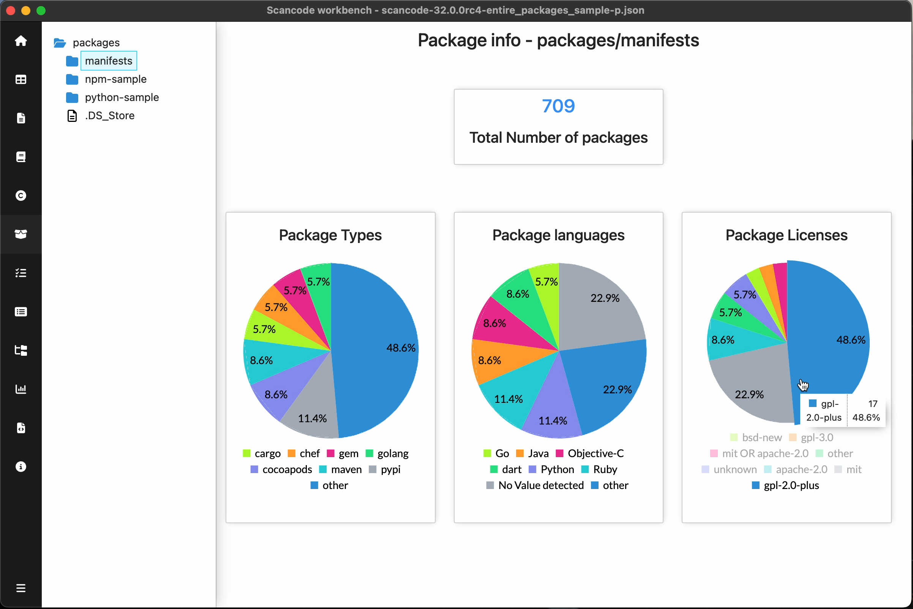
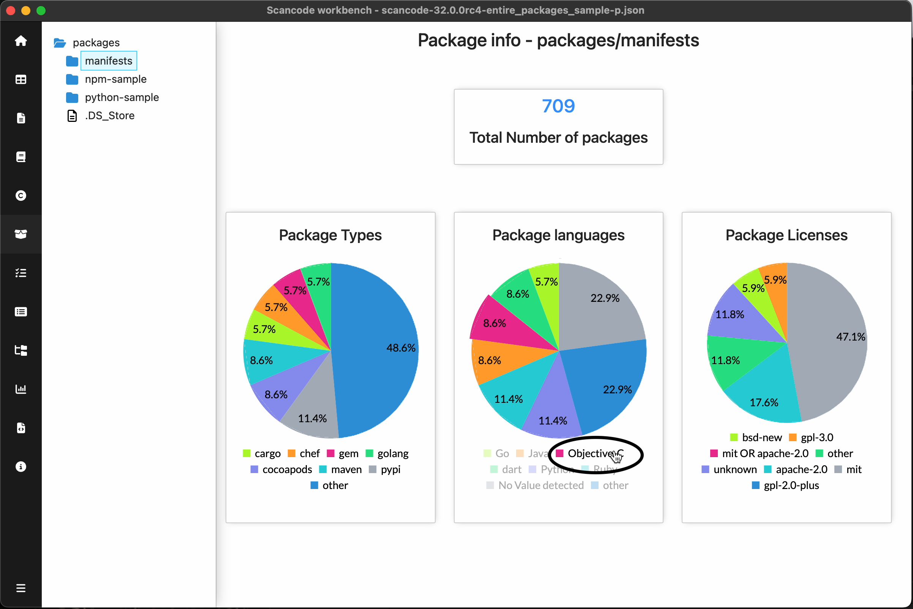
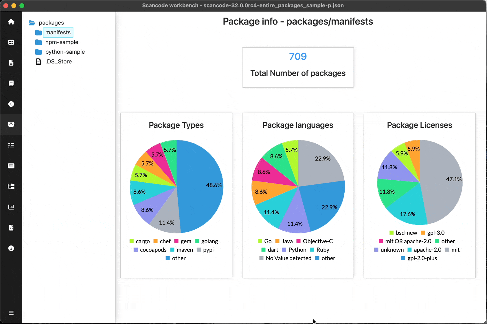

.. _pie-charts:

===========================
:index:`Pie charts`
===========================

Pie charts give a quick overview of the distribution of values for a given attribute.
ScanCode Workbench utilises `c3js <https://c3js.org/>`_ charts on the following views:

- :ref:`file-info-dashboard`
- :ref:`license-info-dashboard`
- :ref:`copyright-info-dashboard`
- :ref:`package-info-dashboard`
- :ref:`dependency-info-dashboard`

Tooltip
--------------------------------

You can hover over the pie chart to see the exact value and percentage of the pie chart.

Legend items
--------------------------------

.. note::
   Legend items are not available on the :ref:`copyright-info-dashboard` due to long copyright statements.

You can hover over the legend items to highlight the corresponding pie chart segment.

You can click on the legend items to toggle the visibility of corresponding pie chart segments.

   Click legend item to toggle segment visibility in Pie chart

.. include:: ../rst_snippets/scans-used.rst
