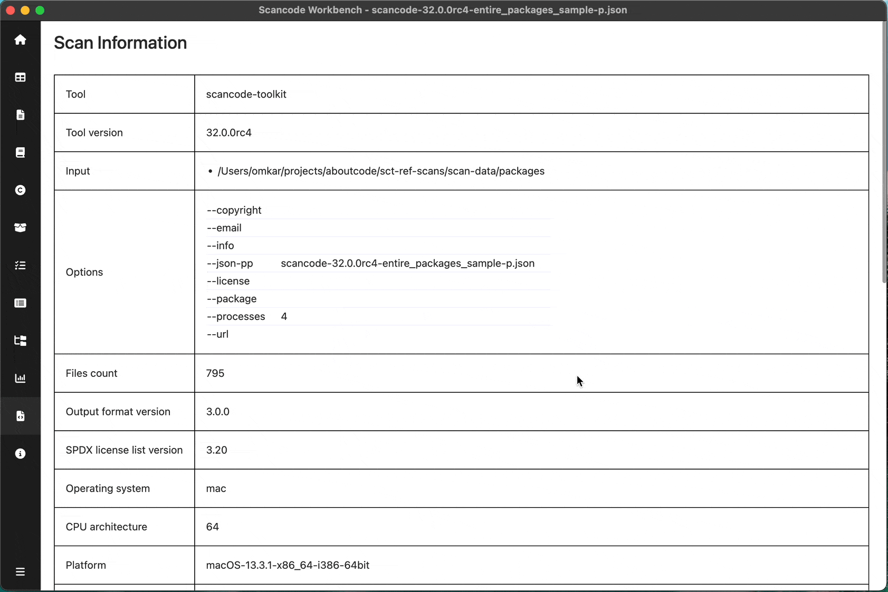

.. _scan-info:

============================
:index:`Scan Info`
============================

Scan Info provides information about the scan available in ``headers`` in the scan.
It provides information about the environment & configuration on host machine when performing the scan. You can also see the raw header JSON at the bottom

Fields:

- ``Tool`` - Name of the tool which generated this scan
- ``Tool version`` - Version of the tool which generated this scan
- ``Input`` - Input path on which scan was run
- ``Scan Options``
- ``Files count``
- ``Output format version`` - Used to track compatibility with current workbench application
- ``SPDX license list version``
- ``Operating system``
- ``CPU architecture``
- ``Platform``
- ``Platform version``
- ``Python version``
- ``Scan duration`` 
- ``Tool notice`` - Notice of the tool which generated this scan
- ``Errors`` (if any)
- ``Raw header``
  

