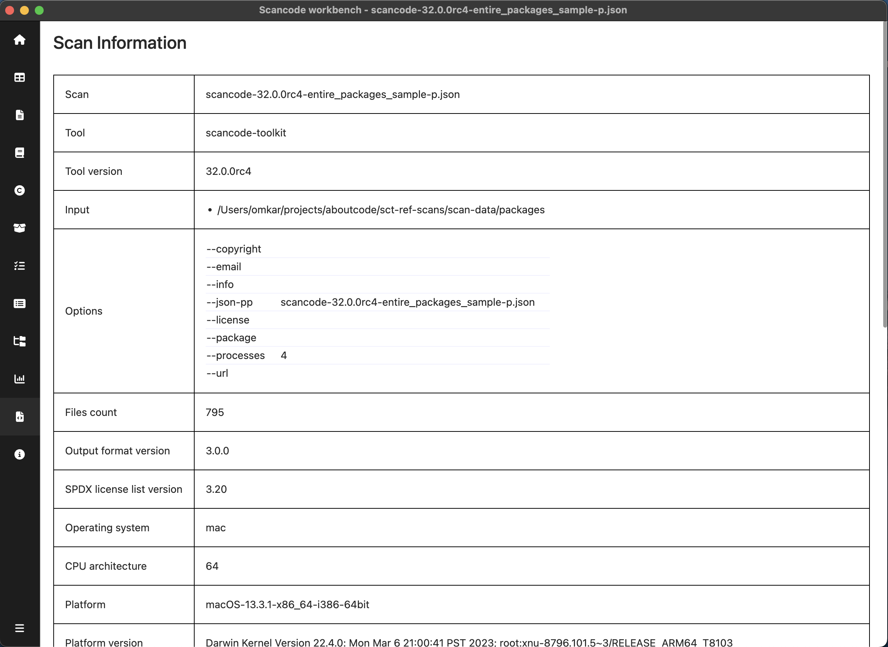
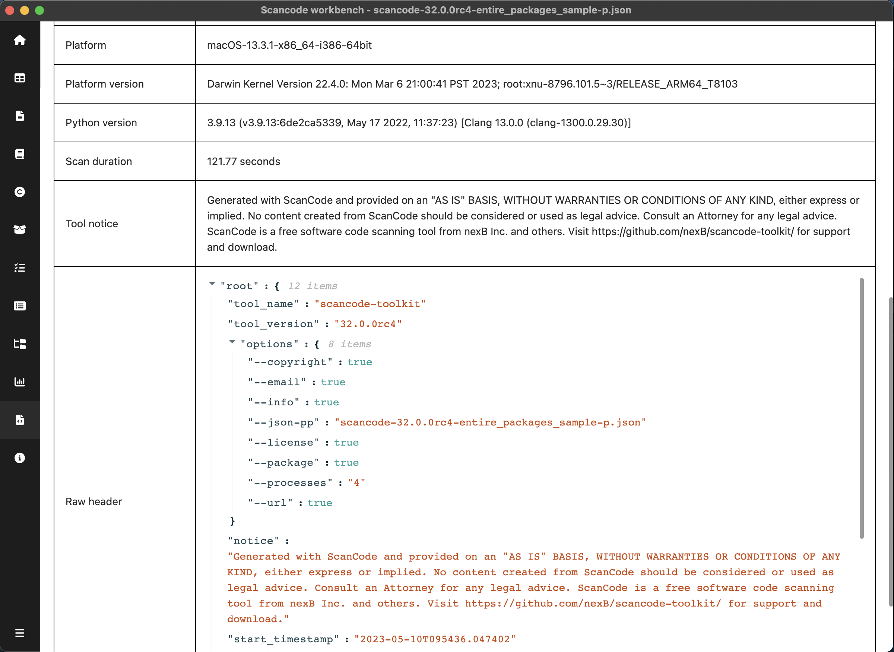

.. _scan-info:

============================
:index:`Scan Info`
============================

Scan Info provides information about the scan available in ``headers`` in the scan.
It provides information about the environment & configuration on host machine
when performing the scan. You can also see the raw header JSON at the bottom

Fields:

- ``Tool`` - Name of the tool which generated this scan
- ``Tool version`` - Version of the tool which generated this scan
- ``Input`` - Input path on which scan was run
- ``Scan Options`` - :doc:`scancode-toolkit:cli-reference/basic-options`.
- ``Files count`` - Total number of files scanned
- ``Output format version`` - Used to track compatibility with current workbench application
- ``SPDX license list version`` - Version of SPDX license list used
- ``Operating system`` - Operating system on which scan was run
- ``CPU architecture`` - CPU architecture on which scan was run
- ``Platform`` - Platform on which scan was run
- ``Platform version`` - Platform version on which scan was run
- ``Python version``
- ``Scan duration``
- ``Tool notice`` - Notice of the tool which generated this scan
- ``Errors`` (if any)
- ``Raw header``

.. include:: ../rst_snippets/scans-used.rst
