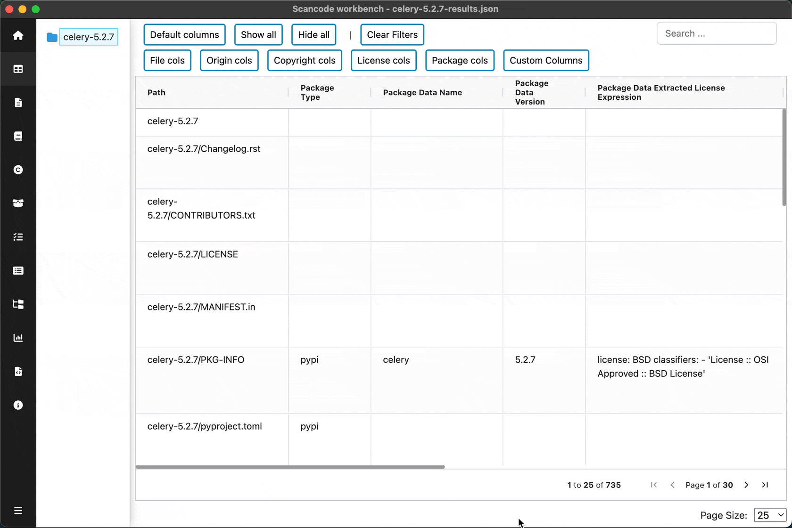
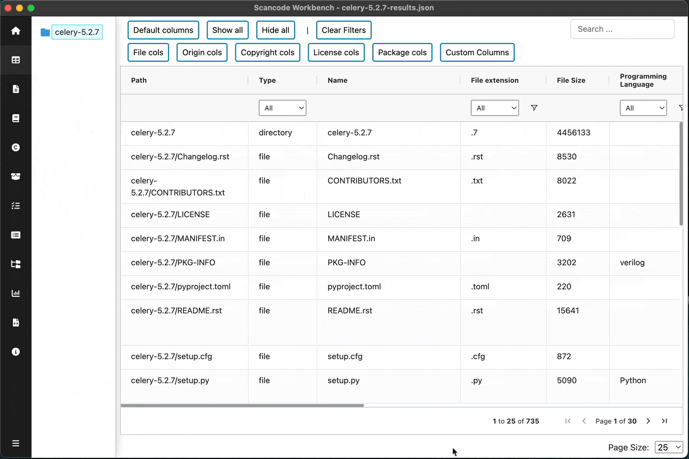
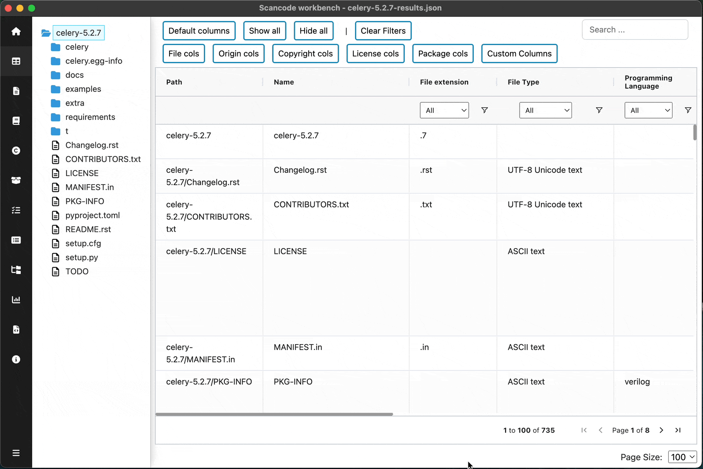
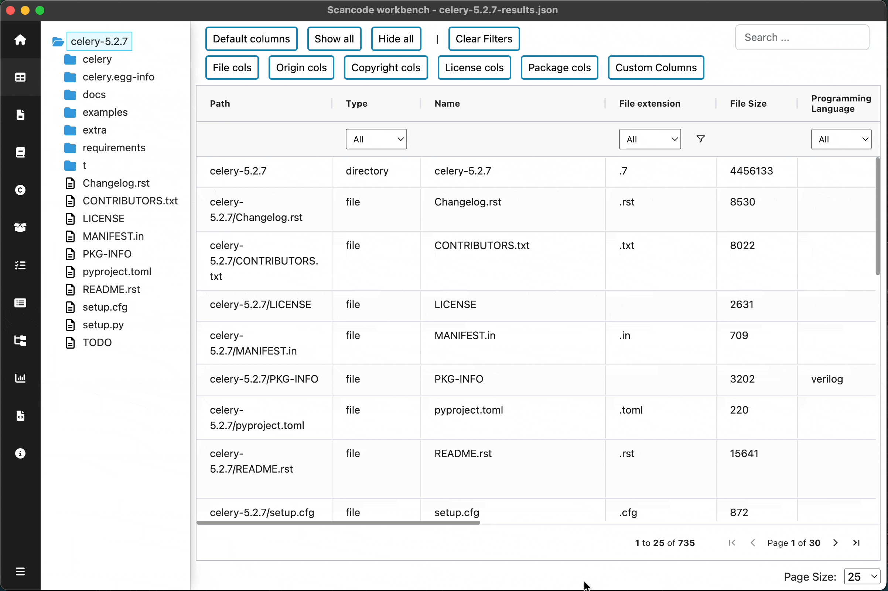
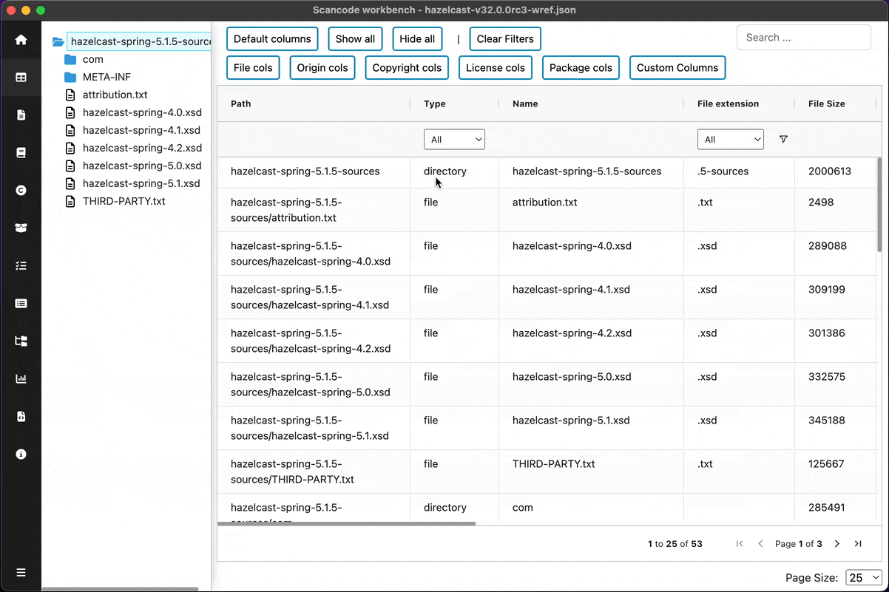
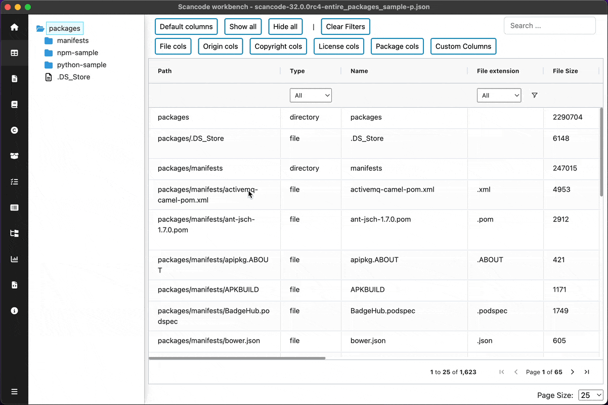
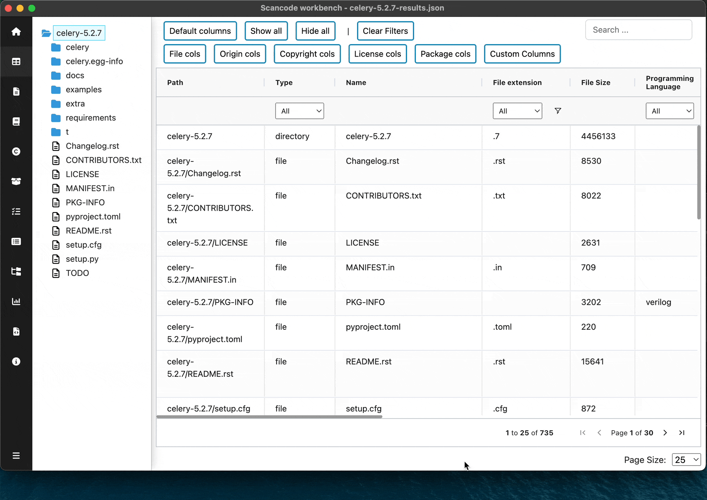

.. _table-view:

===================
:index:`Table View`
===================

In the table view, the available clues detected by `ScanCode Toolkit <https://github.com/nexB/scancode-toolkit/>`_
are shown in a tabular format. A user can see provenance clues such as license and copyright
information detected by ScanCode. A user can also see the file information (e.g., file type,
file size, etc) and package information (package type, primary language of package) that was
detected.

The columns can be sorted as well as shown or hidden based on what the user
preference is. Searching for specific clues (license names, copyrights, etc.)
is also available in this view.

.. Note::
  The data in tableview is only available if corresponding options were enabled when performing the scan.
  Refer - :doc:`scancode-toolkit:cli-reference/list-options`.

----------------
Column groups
----------------

Copyright

- ``copyright_statements``
- ``copyright_holders``
- ``copyright_authors``
- ``copyright_start_line``
- ``copyright_end_line``

File

- ``type``
- ``name``
- ``extension``
- ``size``
- ``programming_language``
- ``mime_type``
- ``file_type``
- ``is_binary``
- ``is_text``
- ``is_archive``
- ``is_media``
- ``is_source``
- ``is_script``

License

- ``detected_license_expression``
- ``detected_license_expression_spdx``
- ``percentage_of_license_text``
- ``license_detections``
- ``license_policy``
- ``license_clues``

Origin

- ``copyright_statements``
- ``license_policy``
- ``email``
- ``url``
- ``mime_type``
- ``file_type``
- ``programming_language``

Package

- ``package_data_type``
- ``package_data_name``
- ``package_data_version``
- ``package_data_extracted_license_statement``
- ``package_data_declared_license_expression``
- ``package_data_declared_license_expression_spdx``
- ``package_data_primary_language``
- ``for_packages``

Misc

- ``scan_error``

.. figure:: data/tableview/tableview-intro.gif

Preset Column Groups
------------------------------
The columns are grouped based on their nature such as
``Copyright Cols``, ``Origin Cols``, ``License Cols``, etc.
User can select one of these groups using the corresponding buttons available
in the quick actions row.

.. figure:: data/tableview/tableview-column-groups.gif

View Custom set of columns
----------------------------------------
In addition to the preset groups, Users can select a custom set of columns by
using the ``Custom Columns`` button found in the quick actions row.

Pin columns
-------------------------------
Users can pin any column(s) to the left by dragging them through the column-header towards the left

Column wise filter & search
-------------------------------------------
User can easily filter rows based on specific column values or use advanced search
using ``and``, ``or`` in combination with different search patterns like
``Contains``, ``Starts with``, etc.

Search in tableview
----------------------------
Use the ``Search`` bar in the top-right corner to perform searches within the
specified directory scope and selected column fields (hidden columns are excluded from the search)

Go to License Explorer
------------------------
User can go to specific licenses in the licenses explorer by the clickable links
in ``License Detections`` column (Grouped under `License cols`).
This will open the license explorer with the target license selected.
Similarly, ``Path`` column in the File regions table in license details pane also
provide links which navigate back to the Table view with that File path selected

Go to Package Explorer
------------------------
User can go to specific package in the package explorer by the clickable
links in ``For Packages`` column (Grouped under `Package cols`).
This will open the package explorer with the target package selected.
Similarly, Datafile paths in package/dependency details pane as well as
dependency table also provide links which navigate back to the Table view
with that File path selected

Pagination
------------------------
Users can easily navigate through rows split into pages, with the flexibility to select a
custom number of rows per page, tailoring the display to their convenience and preferences

